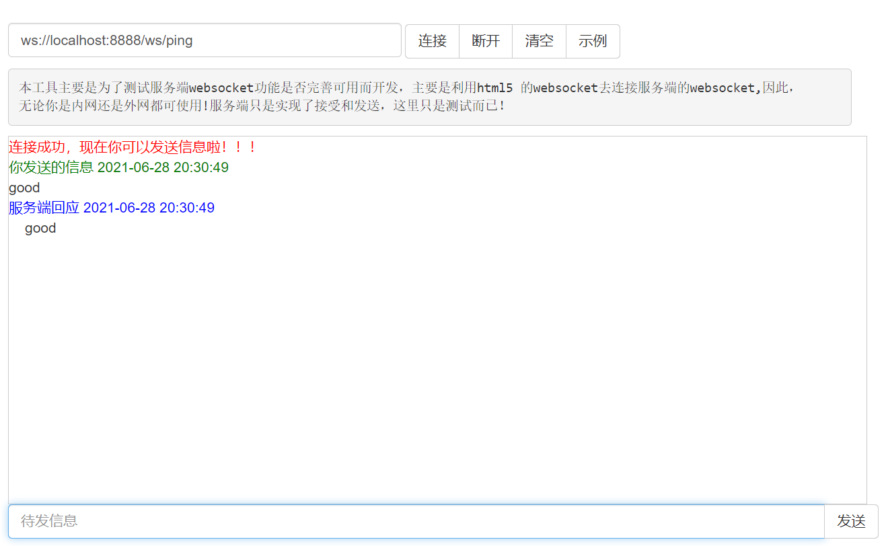

# goweb


## QUICK START


```bash

```

## goweb0 (http,restful,context)

a simple web framework use tcp

how to use

```go
web := goweb.NewWeb("/v1")
web.Get("/ping", func(ctx *goweb.Context) {
    ctx.Json(restfulu.Ok("PONG"))
})
web.RunHTTP(8888)
//http://localhost:8888/v1/ping
```
test

```bash
$ curl localhost:8888/v1/ping
{"code":200,"msg":"OK","data":"PONG"}
```

**performance test**

```go
类型                           RPS
goweb 不解析header:           1917/2088/1836
go 官方 http                  1939/2097/1946
goweb 框架                    1985/1981/2080
```

## goweb1 (websocket)

implements web socket


how to use

```go
web := goweb.NewWeb("/ws")
web.Get("/ping", func(ctx *goweb.Context) {
    //升级为 websocket
    ws, _ := ctx.NewWs()
    for  {
        msg, _ := ws.ReadMsg()
        ws.WriteMsg(msg)
    }
})
web.RunHTTP(8888)
```

test

open this websocket test website: [http://coolaf.com/tool/chattest](http://coolaf.com/tool/chattest)

input your websocket address 

```bash
ws://localhost:8888/ws/ping
```

result



## goweb2 trie router

use trie implements router and params store.

how to use.

```go
web := goweb.NewWeb("/bmft")
web.Get("/v1/doc", func(ctx *goweb.Context) {
    ctx.Json(restfulu.Ok(ctx.Path))
})
web.RunHTTP(8888)
```

test 

```bash
$ curl http://localhost:8888/bmft/v1/doc
{"code":200,"msg":"OK","data":"/bmft/v1/doc"}
```

> trie provide base router function not provide parameter analysis function


## goweb3 group control

how to use 

```go
web := goweb.NewWeb("/bmft")
v1 := web.NewGroup("/v1")
{
    v2 := v1.NewGroup("/v2")
    {
        v2.Get("/ping", func(ctx *goweb.Context) {
            ctx.Json(restfulu.Ok(ctx.Path))
        })
    }
}
web.RunHTTP(8888)
// http://localhost:8888/bmft/v1/v2/ping
```

test

```bash
$ curl http://localhost:8888/bmft/v1/v2/ping
{"code":200,"msg":"OK","data":"/bmft/v1/v2/ping"}
```

### goweb4 middleware


how to use

```go
func logMiddleware(ctx *goweb.Context)  {
	log.Printf("%s-%s",ctx.Method,ctx.Path)
	start := time.Now().UnixNano()
	ctx.Next()
	log.Printf("---COST=%dms\n", (time.Now().UnixNano()-start)/testu.NS_TO_MS)
}
func main() {
	web := goweb.NewWeb("/bmft")
	v1 := web.NewGroup("/v1")
	v1.AddMiddleware(logMiddleware)
	{
		v1.Get("/ping", func(ctx *goweb.Context) {
			ctx.Json(restfulu.Ok(ctx.Path))
		})
	}
	web.RunHTTP(8888)
	// http://localhost:8888/bmft/v1/ping
}
```


test

```bash
$ curl http://localhost:8888/bmft/v1/ping
{"code":200,"msg":"OK","data":"/bmft/v1/ping"}
```

result

```bash
2021/07/01 14:52:56 GET-/bmft/v1/ping
2021/07/01 14:52:56 ---COST=0ms
```

## goweb5 final

* log middle ware

* error try catch

how to use

```bash
web := goweb.NewWeb("/bmft")
v1 := web.NewGroup("/v1")
{
    v1.Get("/ping", func(ctx *goweb.Context) {
        time.Sleep(time.Second)
        panic(fmt.Errorf("error:%s", "error test"))
    })
}
web.RunHTTP(8888)
// http://localhost:8888/bmft/v1/ping
```

test

```bash
$ curl http://localhost:8888/bmft/v1/ping
{"code":500,"msg":"SERVER_ERROR","data":"SERVER_ERROR"}

```
result

```bash
2021/07/01 16:35:16 Listening and serving HTTP on 0.0.0.0:8888
2021/07/01 16:35:21 error:error test
Traceback:
	D:/Enviroment/Go/GoInstall/src/runtime/panic.go:969
	D:/Enviroment/Go/goland.go/goweb/goweb5/main.go:16
	D:/Enviroment/Go/goland.go/goweb/goweb5/goweb/context.go:88
	D:/Enviroment/Go/goland.go/goweb/goweb5/goweb/goweb.go:73
	D:/Enviroment/Go/goland.go/goweb/goweb5/goweb/context.go:88
	D:/Enviroment/Go/goland.go/goweb/goweb5/goweb/goweb.go:91
	D:/Enviroment/Go/goland.go/goweb/goweb5/goweb/context.go:88
	D:/Enviroment/Go/goland.go/goweb/goweb5/goweb/router.go:103
	D:/Enviroment/Go/GoInstall/src/runtime/asm_amd64.s:137
```